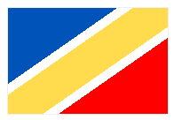

# Яндекс Блиц Фронтенд: Задание #3

Дизайнер разработал логотип. Его потребуется использовать в самых разных условиях. Чтобы это было максимально удобно, сверстайте его с помощью одного HTML-элемента на чистом CSS.

Использовать картинки (даже через data:uri) нельзя.
### Примечания

Ширина: 180px

Высота: 120px

Рамка: 1px, #EFEFEF.

Цвета флага: #0054B9, #FFF, #FFDB4D, #F00.

Угол наклона: 145 градусов.

**Demo:** https://codepen.io/TanyaIgnatenko/pen/gZzZJJ
