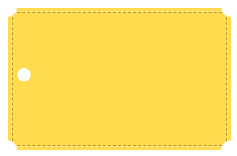

# Яндекс Блиц Фронтенд: Задание #3

Дизайнер разработал логотип. Его потребуется использовать в самых разных условиях. Чтобы это было максимально удобно, сверстайте его с помощью одного HTML-элемента на чистом CSS.

Использовать картинки (даже через data:uri) нельзя.

### Примечания

Ширина: 223px

Высота: 142px

Цвет лейбла: #FFDB4D

Цвет фона: #FFF

Цвет стежков: rgba(0, 0, 0, .3) + rgba(255, 255, 255, .5)

Вырубка по углам: 18x18

Центральное отверстие: 12x12

**Demo:** https://codepen.io/TanyaIgnatenko/pen/OrZgOz

